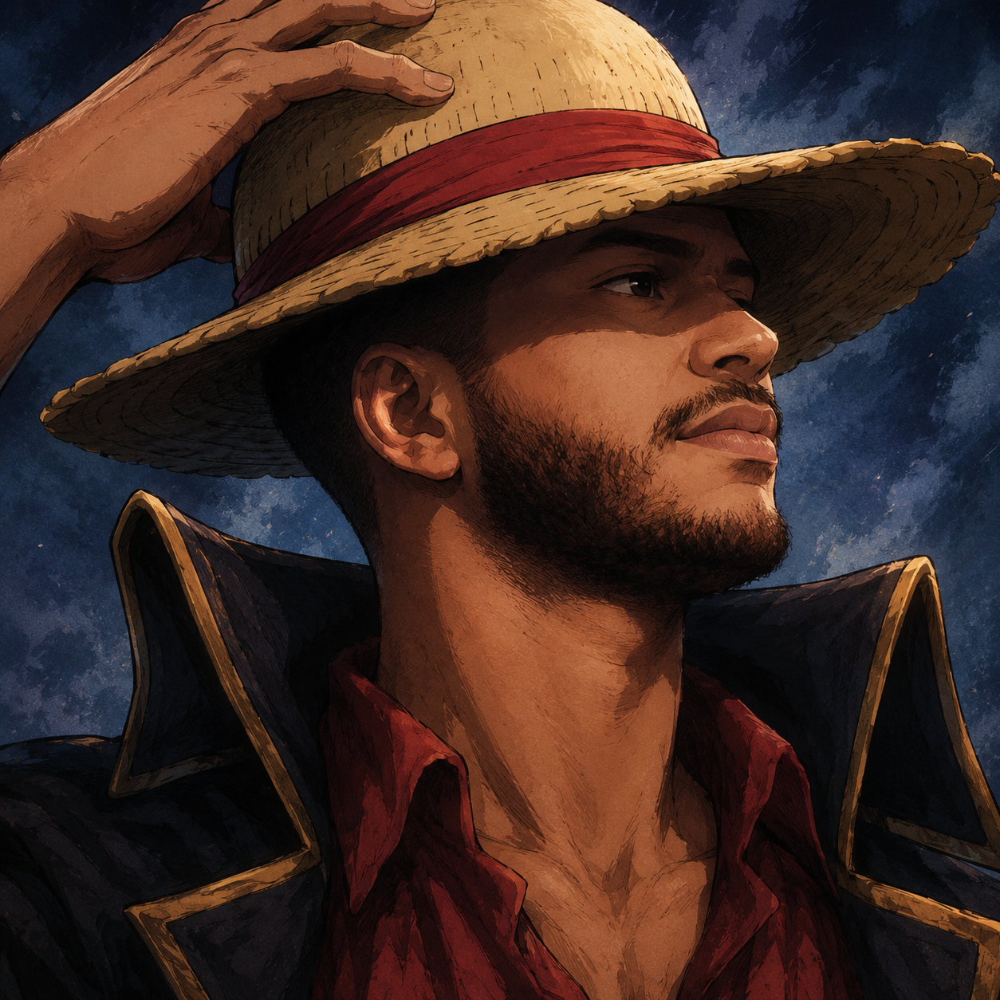

  

  
  
  

  
  
  
  

---

## ☠️ Diário de Bordo

<table>
  <tr>
    <td width="230" valign="top">
      
    </td>
    <td valign="top">
      Desenvolvedor <b>backend</b> com foco em sistemas de <b>alta disponibilidade</b> e ambientes <b>financeiros críticos</b>. Atuo principalmente com <b>Java (Spring Boot)</b> e <b>Node.js (NestJS)</b>, aplicando <b>Microsserviços</b>, <b>Arquitetura Hexagonal</b> e <b>DDD</b> para construir soluções resilientes e sustentáveis.  
      Tenho experiência com <b>antecipação de recebíveis</b>, sustentação em produção, resolução de incidentes e cultura de <b>observabilidade</b>.  
      Atualmente cursando a <b>Pós-graduação em Arquitetura e Desenvolvimento em Java (FIAP)</b>, com foco constante em boas práticas, qualidade de código e entrega de valor ao negócio.
    </td>
  </tr>
</table>

  
  

---

## ⚔️ Arsenal Técnico

  
  
  
  
  

  
  
  
  

  
  
  
  
  
  
  

<table>
  <tr>
    <td valign="top" width="33%">
      <b>Backend &amp; Núcleo</b>  
      Java, Spring Boot, Node.js, NestJS, Microsserviços, Arquitetura Hexagonal, DDD, REST.
    </td>
    <td valign="top" width="33%">
      <b>Dados</b>  
      PostgreSQL, MySQL, Oracle, MongoDB, JPA, modelagem e alta disponibilidade.
    </td>
    <td valign="top" width="33%">
      <b>Ops &amp; Observabilidade</b>  
      Docker, Git, Grafana, Prometheus, Splunk, Scrum, Kanban, Jira.
    </td>
  </tr>
</table>

---

## 🏴‍☠️ Recompensa Atual

  
  

  

---

  

  <i>"Um bom sistema, como um bom navio, se mede pela tempestade que atravessa sem afundar."</i>

